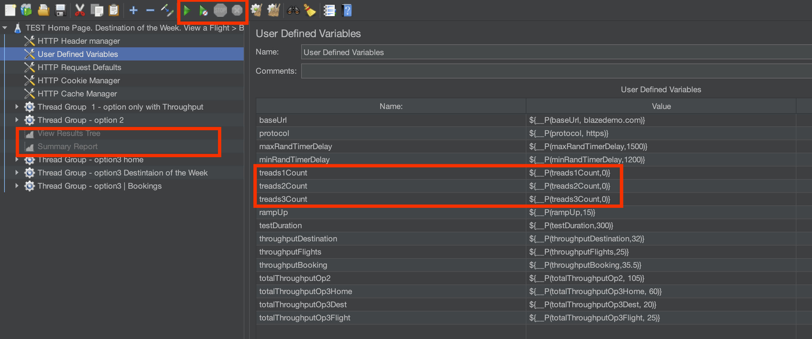

# Project Overview

This project includes a JMeter performance test script, a Dockerfile for building a JMeter report server, and a Bash script to automate the test execution. The project aims to perform load testing on the BlazeDemo website and generate performance reports.

## File Descriptions

### blazedemo_h60d20f15b5.jmx

This is the JMeter test plan file. It contains the configuration and test plan details for the performance tests. The test plan is designed to simulate user interactions with the BlazeDemo website, including searching for flights, selecting destinations, and booking flights.

> To run with jmeter GUI do next: 
>
> * Open jmeter version 5.6.3 (expects that jmeter was installed)
> * Inside jmeter open blazedemo_h60d20f15b5.jmx
> * Provide number of treads(Users) that you want to run to specidic tread ()treads${NUM}Count) depens on tread group option need to be run
> * Enable listiners to visualise your data
> * Click start button (green arrow) to run test



To run jmeter cli use next command 

```
jmeter -n -t blazedemo_h60d20f15b5.jmx \
    -JbaseUrl="blazedemo.com" \
    -Jprotocol="https" \
    -JmaxRandTimerDelay=1000 \
    -JminRandTimerDelay=750 \
    -Jtreads${optionToRun}Count=5 \
    -JrampUp=15 \
    -JtestDuration=1 \
    -JthroughputDestination=32 \
    -JthroughputFlights=25 \
    -JthroughputBooking=35 \
    -JtotalThroughputOp2=105 \
    -JtotalThroughputOp3Home=60 \
    -JtotalThroughputOp3Dest=20 \
    -JtotalThroughputOp3Flight=25 \
    -l "data/log.jtl" -j  "data/test.log" -e -o  "data/out"
```

* `jmeter`: Runs the JMeter application.
* `-n`: Indicates non-GUI mode, which is suitable for command-line execution.
* `-t blazedemo_h60d20f15b5.jmx`: Specifies the test plan file to be used.
* **`-l "$resultFolderPath/log.jtl"`** : Specifies the file path to save the test results log.
* **`-j "$resultFolderPath/test.log"`** : Specifies the file path to save the JMeter run log.
* **`-e -o "$resultFolderPath/out"`** :
  * `-e`: Generates the HTML report.
  * `-o "$resultFolderPath/out"`: Specifies the output directory for the HTML report.
* `-Jproperties`: Specifies property insdide jmeter. All properties has defualt values. So it can be skip. Like `jmeter -n -t blazedemo_h60d20f15b5.jmx -l "data/log.jtl" -j  "data/test.log" -e -o  "data/out"`

After test finish you can find all info inside data folder

### jmeter_test.sh

The `jmeter_test.sh` script is a Bash script that automates the execution of the JMeter. It allows for various configurations and options to be set via command-line arguments. The script handles the setup, execution, and reporting of the test.

#### Usage

Run the script with various options to customize the test execution. Below is a brief overview of the available options:

* (reqired) `-optionToRun`: Select the option to run (1: Transaction Controller, 2: One thread with Precise Throughput Timer, 3: Three threads with Precise Throughput Timer)
* `-treadCount`: Number of threads (users) to run (default: 5)
* `-baseUrl`: Base URL for the test (default: blazedemo.com)
* `-protocol`: Protocol to use (default: https)
* `-maxRandTimerDelay`: Maximum random timer delay in milliseconds (default: 1000)
* `-minRandTimerDelay`: Minimum random timer delay in milliseconds (default: 750)
* `-rampUp`: Ramp-up time in seconds (default: 15)
* `-testDuration`: Test duration in minutes (default: 1)
* `-throughputDestination`: Throughput for Destination of the week requests (default: 32%)
* `-throughputFlights`: Throughput for flights requests (default: 25%)
* `-throughputBooking`: Throughput for booking requests (default: 35%)
* `-totalThroughputOp2`: Total throughput in option 2 requests per minute (default: 105)
* `-totalThroughputOp3Home`: Total throughput in option 3 for home requests (default: 60 requests per minute)
* `-totalThroughputOp3Dest`: Total throughput in option 3 for destination requests (default: 20 requests per minute)
* `-totalThroughputOp3Flight`: Total throughput in option 3 for flight requests (default: 25 requests per minute)
* `-distribution`: IPs for JMeter distribution test (default: "")
* `-h`, `--help`: Display help message

#### Example Command

```
./jmeter_test.sh -optionToRun 1 -treadCount 10 -baseUrl example.com -protocol http -testDuration 5

```

This command will run the test with the following configurations:

* Option 1
* 10 threads (users)
* Base URL: example.com
* Protocol: http
* Test duration: 5 minutes

After test it will genarete a folder with results and create a link to report 

## How to Run Docker report generation

1. Ensure Docker is installed.
2. Run the `jmeter_test.sh` script with the desired options.
3. The script will execute the JMeter test plan and generate a report.
4. The report will be served via a Docker container. Access the report at `http://localhost:<port>/index.html`.

### Prerequisites

* Docker
* JMeter
* Bash

### Building and Running the Docker Image

To build and run the Docker image for the JMeter report:

```
docker build -t jmeter-report --build-arg jmeter_report_path=<path_to_report> .
docker run -d -p <port>:80 jmeter-report

```

Replace `<path_to_report>` with the path to the JMeter test report directory, and `<port>` with the desired port number.

## Notes

* Ensure all required dependencies are installed before running the scripts.
* Customize the scripts and configurations as needed to suit your specific testing requirements.
